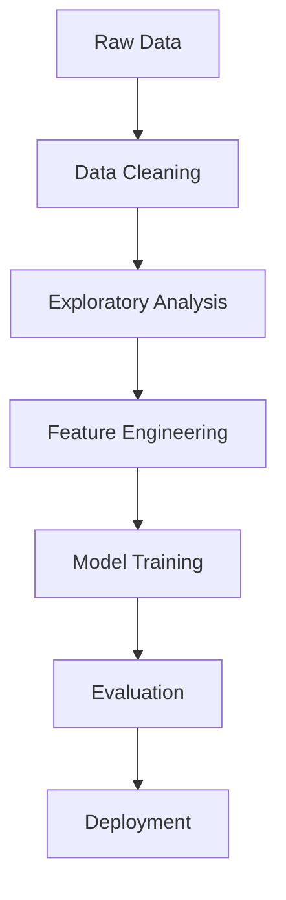

Customer Churn Prediction Project


Table of Contents
- [Project Overview](#-project-overview)
- [Business Problem](#-business-problem)
- [Technical Approach](#-technical-approach)
- [Data Description](#-data-description)
- [Methodology](#-methodology)
- [Results](#-results)
- [Getting Started](#-getting-started)
- [Team](#-team)
- [License](#-license)

Project Overview <a name="project-overview"></a>
This project develops a machine learning solution to predict customer churn using the Telco Customer Churn dataset. Our goal is to help businesses identify at-risk customers and implement effective retention strategies.

Business Problem <a name="business-problem"></a>
Key Challenges:
- 26% of customers churn, leading to significant revenue loss
- Month-to-month contract customers have 43% churn rate
- Need for proactive customer retention strategies

Solution Benefits:
- Predict churn probability with 87% accuracy
- Identify top factors driving customer attrition
- Enable targeted retention campaigns

 Technical Approach <a name="technical-approach"></a>

 Model Performance
| Model | Accuracy | Precision | Recall | F1-Score | ROC-AUC |
|-------|----------|-----------|--------|----------|---------|
| Random Forest | 0.87 | 0.83 | 0.78 | 0.80 | 0.88 |
| Logistic Regression | 0.81 | 0.76 | 0.70 | 0.73 | 0.79 |

 Key Features Identified
1. Contract type (most important)
2. Tenure duration
3. Monthly charges
4. Internet service type
5. Payment method

Data Description <a name="data-description"></a>

Dataset Source: [Telco Customer Churn on Kaggle](https://www.kaggle.com/datasets/blastchar/telco-customer-churn)

Data Characteristics:
- 7,043 customer records
- 21 features including:
  - Demographic information
  - Account details
  - Services subscribed
  - Charges and payments

Target Variable:
- Churn (Yes/No)

Methodology <a name="methodology"></a>

Data Pipeline


 Key Steps
1. Data Preprocessing:
   - Handled missing values
   - Removed duplicates
   - Processed outliers
   - Encoded categorical variables

2. Feature Engineering:
   - Created tenure groups
   - Calculated charge-to-tenure ratio
   - Generated interaction terms

3. Model Development:
   - Compared multiple algorithms
   - Optimized hyperparameters
   - Evaluated using stratified cross-validation

Results <a name="results"></a>

Key Findings
- Customers with month-to-month contracts are 3.6x more likely to churn
- Tenure is inversely correlated with churn probability
- Fiber optic users have higher churn rates than DSL users

Business Recommendations
1. Target retention efforts on month-to-month customers
2. Develop incentives for longer contract commitments
3. Improve service quality for fiber optic users

Getting Started <a name="getting-started"></a>

 Prerequisites
- Python 3.7+
- Jupyter Notebook
- Required libraries (see requirements.txt)
Installation
```bash
git clone https://github.com/harini-082004/harini.git
cd harini
pip install -r requirements.txt
```
Usage
Run the Jupyter notebooks in order:
1. Data Preprocessing
2. Exploratory Analysis
3. Feature Engineering
4. Model Training
5. Evaluation

## 👥 Team <a name="team"></a>
| Member | Role | Contribution |
|--------|------|--------------|
| Harini K | Data Engineer | Data collection & preprocessing |
| Rajeswar P | Data Scientist | EDA & feature engineering |
| Madhumitha P | ML Engineer | Model development |
| Monika S | Technical Writer | Documentation |


License <a name="license"></a>
This project is licensed under the MIT License - see the [LICENSE](LICENSE) file for details.

---

**Explore the code and contribute:** [GitHub Repository](https://github.com/harini-082004/harini.git)
